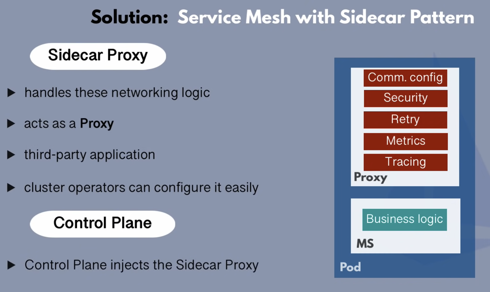
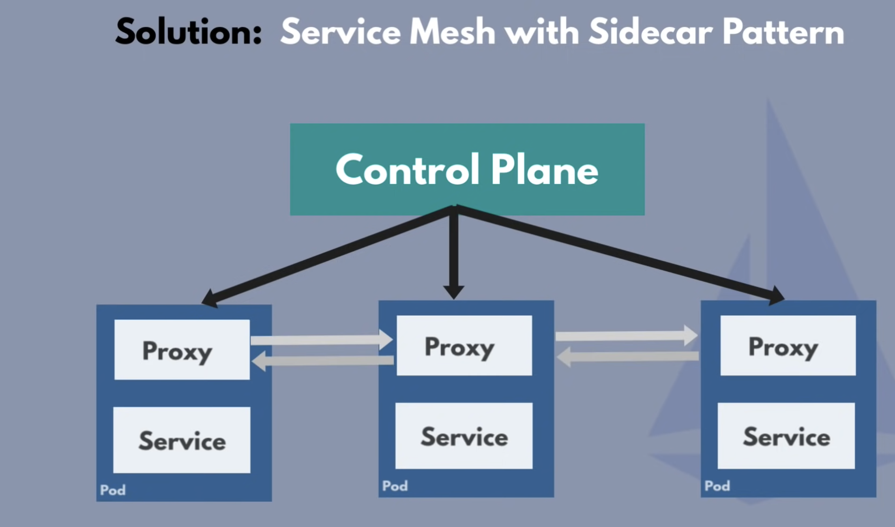
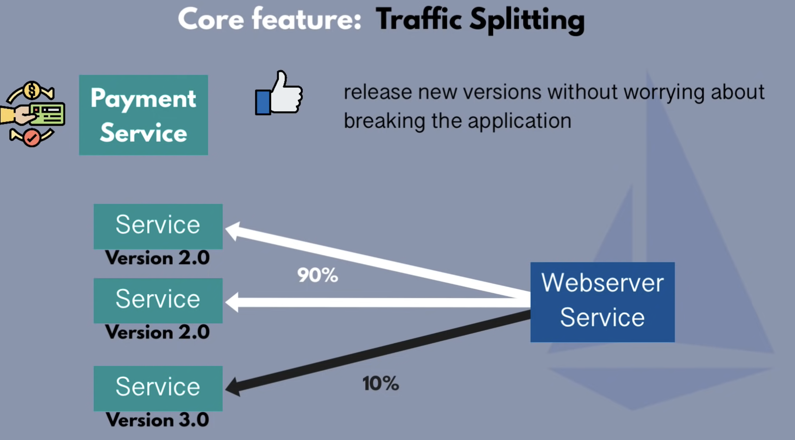
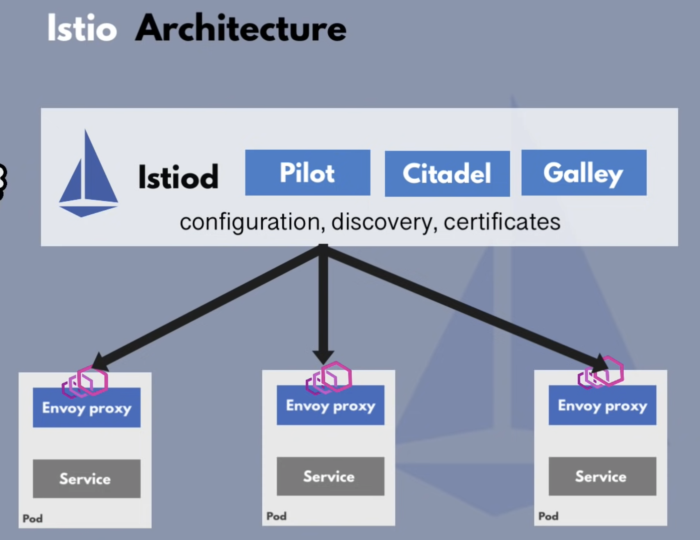
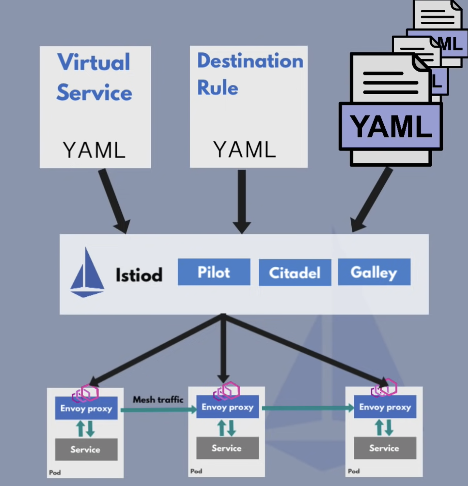
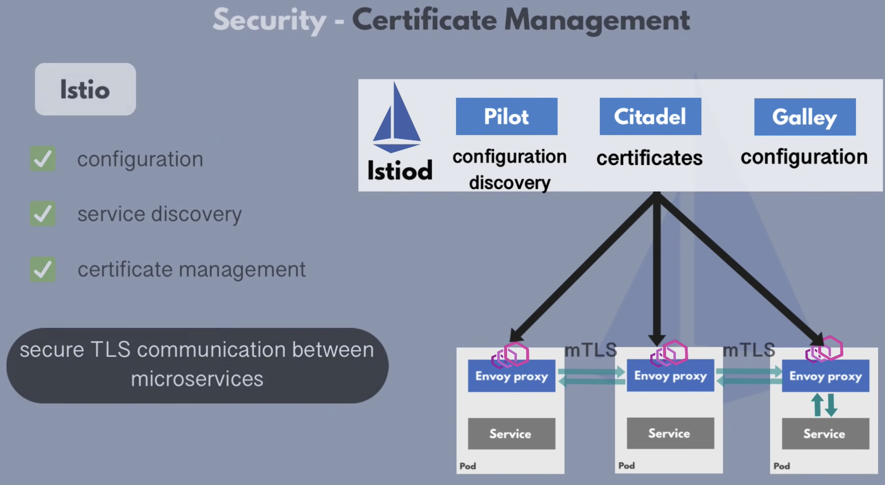
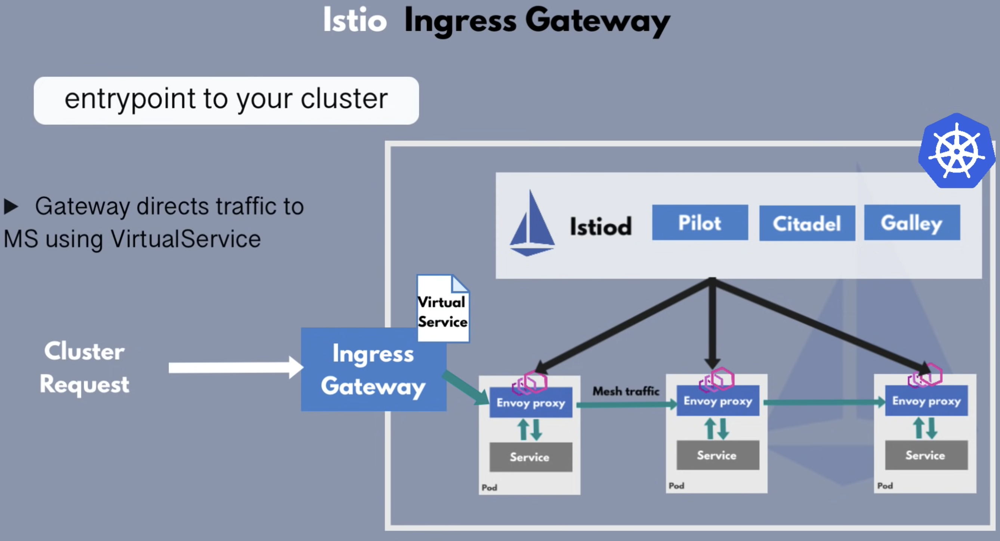

### Service Mash
`Service mash(SM)` это паттерн, описывающий управление взаимодействием между микросервисами.

SM реализуется с помощью паттерна сайдкара

`Proxy` - это service mash

### Основные цели использования service mash
1) Управление траффиком (Traffic management). Как перенаправлять траффик между сервисами, особенно в условиях когда запущено несколько разных версий приложения. Например, canary deployment:
    
2) Безопасность (Security). Отвечает за безопасное взаимодействие между сервисами в масштабируемом процессе.
3) Устойчивость к падению (Fault Tolerance). Что случится когда один сервис упадет, а другой продолжит свою работу.
4) Мониторинг (Observability). Как мониторить поведение, обнаруживать ошибки и отклонения.

`Istio` - реализация `service mash`.

Существует 2 основных компонента istio (CRD - Custom Resource Definition):
1) `Virtual service`. Описывает как маршрутизировать траффик до нужного сервиса
2) `Destination Rule`. Когда траффик приходит на сервис, это компонент описывает, что с ним делать перед тем как попадет до конечной точки.

`Istiod` конвертирует описанные высокоуровневые правила в envoy-specific конфигурацию, и отправляет эту конфигурацию в envoy-proxy сайдкары.
Т.е конфигурируются не сами прокси, а `control plane Istiod`, а она уже конфигурирует прокси. 

### Istio features:
- Service discovery. Istion автоматически регистрирует новые создаваемые поды в кластере.
- Security - certificate management. Позволяет выставлять безопасное mTls взаимодействие между сервисами.
    
- Metrics and tracing. Собирает метрики от `envoy-proxy`, которые в свою очередь могут получать их например от `prometheus`

### Istio gateway
`Istio ingress gateway` это входная точка в кластер k8s

