K8s - оркестратор контейнеров от гугла

### Какие задачи решает
- высокая доступность сервисов
- масштабируемость или высокая производительность
- disaster recovery. Бэкапы и восстановление

## Кластер K8s
Кластер k8s состоит из узлов(nodes). Нода - это физический или виртуальный сервер. Количество рабочих узлов зависит от нагрузки на кластер.
Есть главный узел(master node) и рабочие узлы(worker node). Master node контролирует работу рабочих узлов. На рабочих узлах непосредственно деплоятся сами контейнеры.
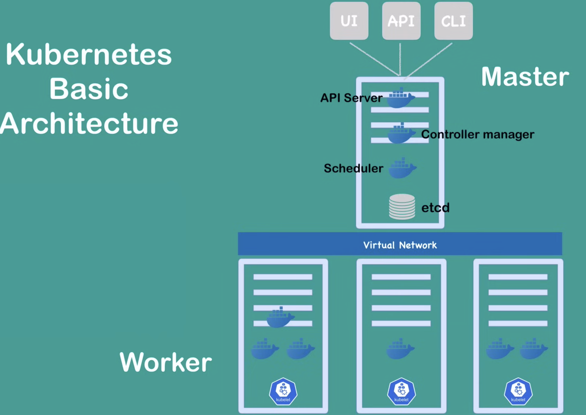

### Сервисы(процессы), которые есть только на главном узле:
- API Server. Через него проходит коммуникация между главным и рабочими узлами. Рабочие узлы используют kubelet для взаимодействия с API Server
    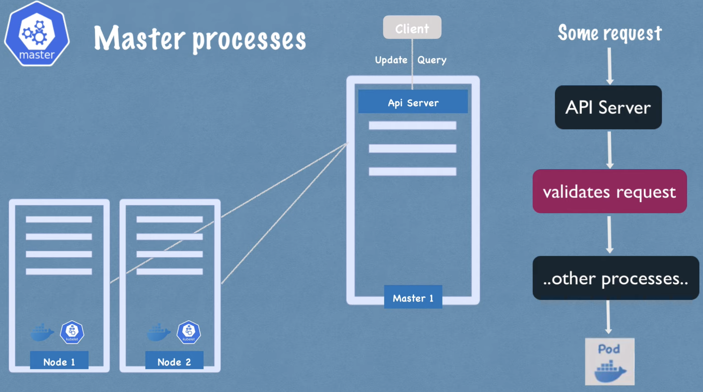
- Scheduler. Его задача планировать и распределять нагрузку между рабочими узлами в рамках кластера. Например, когда говорим что хотим приклад на 3 подах, этот сервис будет решать на каких узлах будут созданы поды.
    
- Kube Controller Manager. Контролирует все поды в рамках кластера
- Cloud Controller Manager. Взаимодействует с облачным провайдером, если кластер в облаке
- etcd. Отвечает за сохранение всей информации о кластере. Эти данные сохраняются на мастер ноде.
    


### Каждый узел содержит все себе следующие сервисы(процессы):
- kubelet. Отвечает за коммуникацию между разными узлами в рамках кластера
- kube-proxy. Отвечает за сетевые ресурсы в рамках каждого узла.
- container runtime. Отвечает за создание и контроль контейнеров на узлах, в том числе и на master node. Например docker, container-d etc..

### Пример реального кластера


### Управление кластером
kubectl - консольная утилита для управления кластером, взаимодействует с API Server на главном узле.


### Основные компоненты k8s
- `Pod`. минимальная единица, абстракция над контейнером
    
    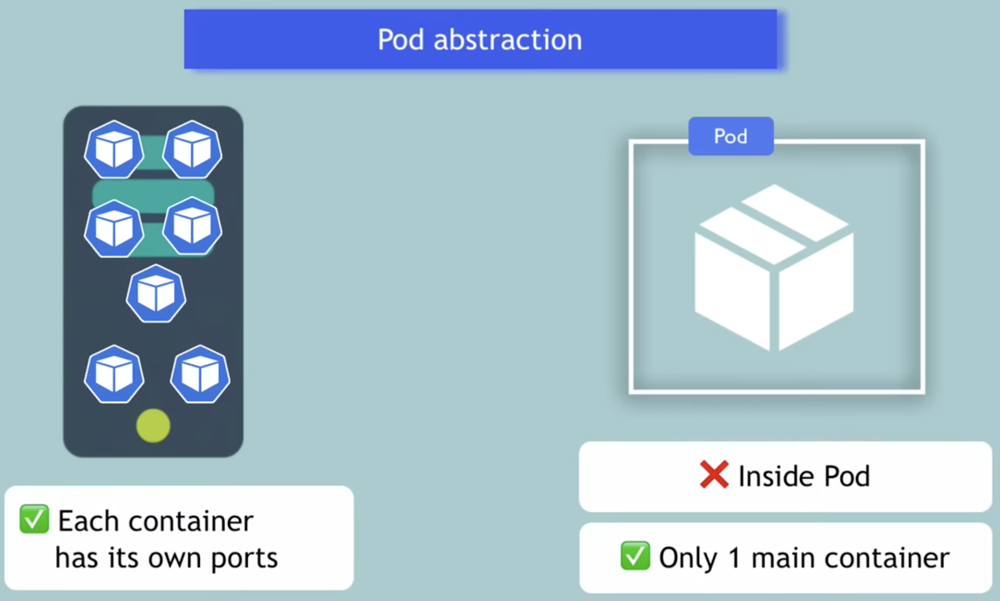
    В поде может больше одного контейнера, тогда они будут взаимодействовать по localhost и порту на котором развернуто приложение. Пример конфигурации
    ```yaml
        apiVersion: v1
        kind: Pod
        metadata:
        name: nginx
        labels:
        app: nginx
        spec:
        containers:
        - name: nginx-container
          image: nginx
          ports:
            - containerPort: 80
        - name: sidecar
          image: curlimages/curl
          command: ["/bin/sh"]
          args: ["-c", "echo Hello from the sidecar container; sleep 300"]
    ```
    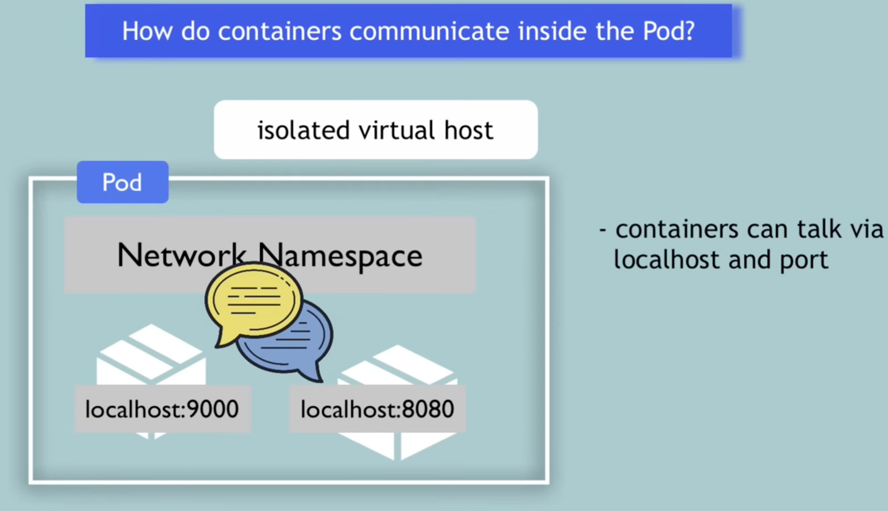


- `Service`. Абстракция для управления подами, имеет стабильный ip-адрес в отличие от пода. Существует два типа сервиса: external (открывает порт сервиса наружу по ip адресу ноды + порту), internal - только внутри кластера
    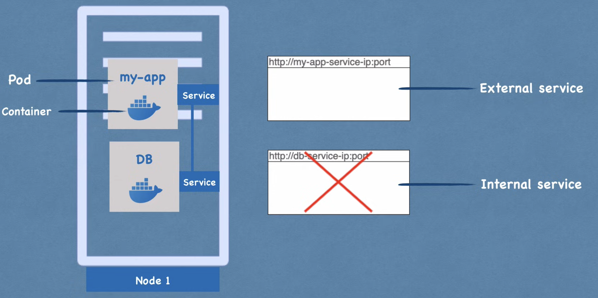
    1) `ClusterIp`. Доступен для обращения только внутри кластера k8s
    2) `NodePort`. Открывает внешний порт на каждой ноде. С этого внешнего порта будет проксирование на порт внутрь кластера, а с него уже на конкретную поду. NodePort должен быть между 30000-32767, все остальные значения будут исключаться.
        ```shell
        evggorainov@MacBook-Air-Evgenij ~ % minikube ip
        192.168.49.2
    
        evggorainov@MacBook-Air-Evgenij ~ % k get svc
        NAME                  TYPE        CLUSTER-IP      EXTERNAL-IP   PORT(S)          AGE
        kubernetes            ClusterIP   10.96.0.1       <none>        443/TCP          3h47m
        my-nginx-deployment   NodePort    10.106.59.197   <none>        8888:31768/TCP   2m5s
        ```
       К деплойменту my-nginx-deployment можно подключиться по ip адресу 192.168.49.2:31768
        ```shell
         evggorainov@MacBook-Air-Evgenij ~ % curl -v http://192.168.49.2:31768
         *   Trying 192.168.49.2:31768...
        ```
       Так как minikube запущен к докере, поэтому ip адрес ноды не доступен.
       Для того, чтобы получить доступ, можно создать туннель с помощью миникуба
        ```shell
        minikube service my-nginx-deployment --url
        http://127.0.0.1:55970
        ```
       Теперь по этому адресу будет доступ
        ```shell
        evggorainov@MacBook-Air-Evgenij ~ % curl -v http://127.0.0.1:55970
        *   Trying 127.0.0.1:55970...
        * Connected to 127.0.0.1 (127.0.0.1) port 55970
                >   GET / HTTP/1.1
                >   Host: 127.0.0.1:55970
                >   User-Agent: curl/8.7.1
                >   Accept: */*
                >
               * Request completely sent off
                 < HTTP/1.1 200 OK
                 < Server: nginx/1.29.4
                 < Date: Mon, 02 Feb 2026 13:35:14 GMT
                 < Content-Type: text/html
                 < Content-Length: 615
                 < Last-Modified: Tue, 09 Dec 2025 18:28:10 GMT
                 < Connection: keep-alive
                 < ETag: "69386a3a-267"
                 < Accept-Ranges: bytes
                 <
               <!DOCTYPE html>
               <html>
               <head>
               <title>Welcome to nginx!</title>
               <style>
               html { color-scheme: light dark; }
               body { width: 35em; margin: 0 auto;
               font-family: Tahoma, Verdana, Arial, sans-serif; }
               </style>
               </head>
               <body>
               <h1>Welcome to nginx!</h1>
               <p>If you see this page, the nginx web server is successfully installed and
               working. Further configuration is required.</p>
                
               <p>For online documentation and support please refer to
               <a href="http://nginx.org/">nginx.org</a>.<br/>
               Commercial support is available at
               <a href="http://nginx.com/">nginx.com</a>.</p>
                
               <p><em>Thank you for using nginx.</em></p>
               </body>
               </html>
               * Connection #0 to host 127.0.0.1 left intact
       ```
       Удалить сервис
        ```shell
                   evggorainov@MacBook-Air-Evgenij ~ % k delete svc my-nginx-deployment
                   service "my-nginx-deployment" deleted from default namespace
        ```
     3) `LoadBalancer`.
        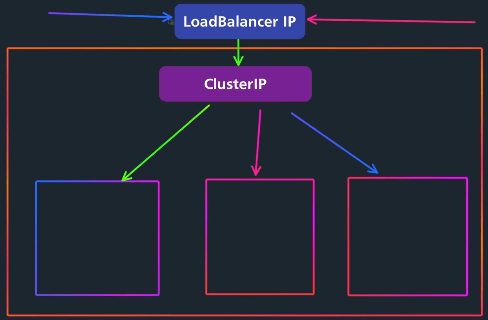
        Для того, чтобы можно было подключаться снаружи к кластеру миникуба
        ```shell
           evggorainov@MacBook-Air-Evgenij ~ % minikube tunnel
           ✅  Tunnel successfully started
        ```
        Создать сервис типа loadBalancer
        ```shell
         k expose deploy my-nginx-deployment --type=LoadBalancer --port=9999 --target-port=80
        ```
        ```shell
         evggorainov@MacBook-Air-Evgenij ~ % k get svc
         NAME                  TYPE           CLUSTER-IP    EXTERNAL-IP   PORT(S)          AGE
         kubernetes            ClusterIP      10.96.0.1     <none>        443/TCP          4h10m
         my-nginx-deployment   LoadBalancer   10.102.36.7   127.0.0.1     9999:30361/TCP   5s
        ```
        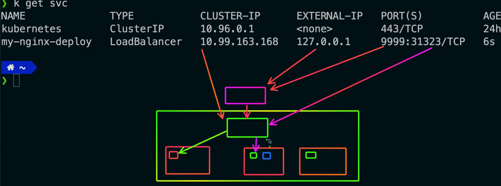
        Теперь my-nginx-deployment будет доступен через `curl -v http://localhost:9999`
- `Ingress`. Позволяет обратиться к сервису снаружи кластера по доменному имени
    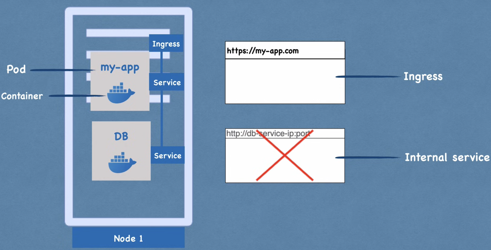
- `ConfigMap and Secret`. ConfigMap хранит внешнюю конфигурацию сервиса. Secret - для хранения паролей, сертификатов
    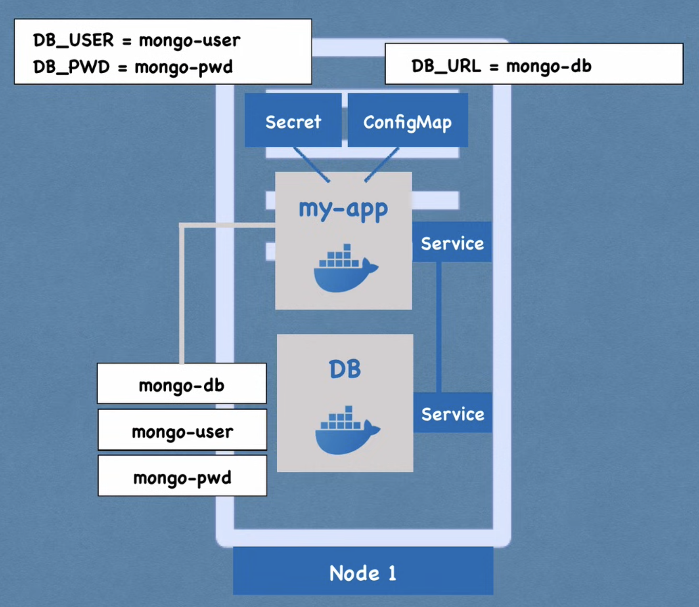
    Примеры использования configMap, secret в конфигурации k8s
    1) [mongodb-config-components.yml](specifications/mongodb-config-components.yml)
    2) [mosquitto-config-components.yml](specifications/mosquitto-config-components.yml)

    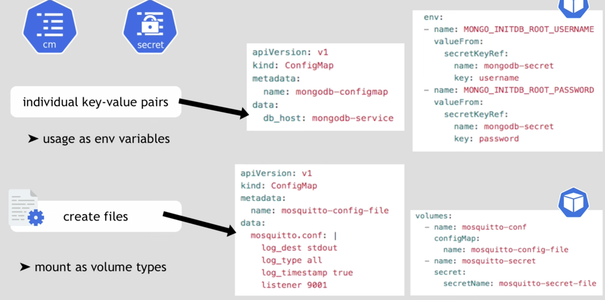
- `Volumes`. Нужны для хранения постоянных данных поды вне кластера, позволяет в случае рестарта поды работать с сохраненными данными
    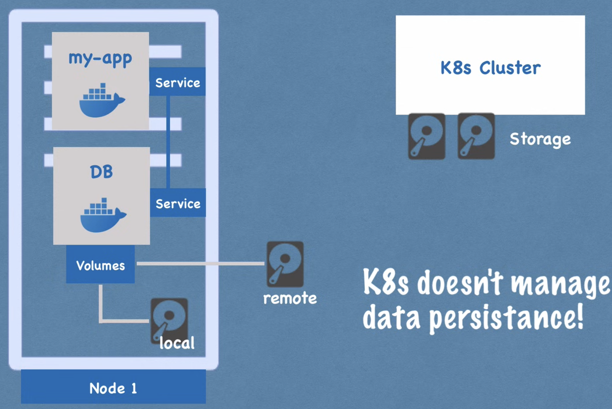
    
    Основные компоненты volumes:
    1) `Persistence volume`.
        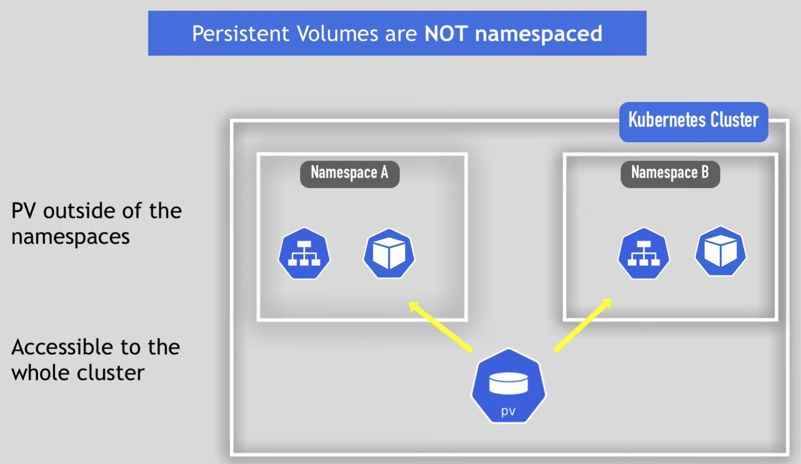
    2) `Persistence volume claim`.
        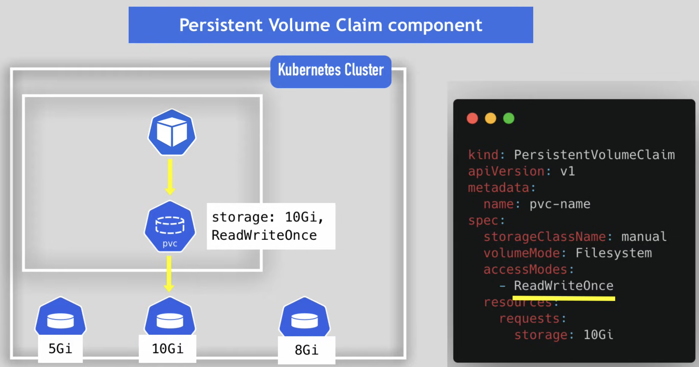
        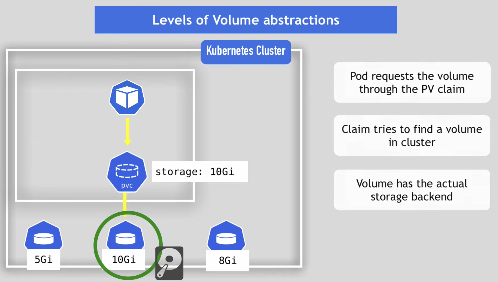
    3) `Storage class`.
        Позволяет создавать persistence volume в автоматическом режиме. Указывается облачный провайдер и характеристики, которые будет иметь PV
        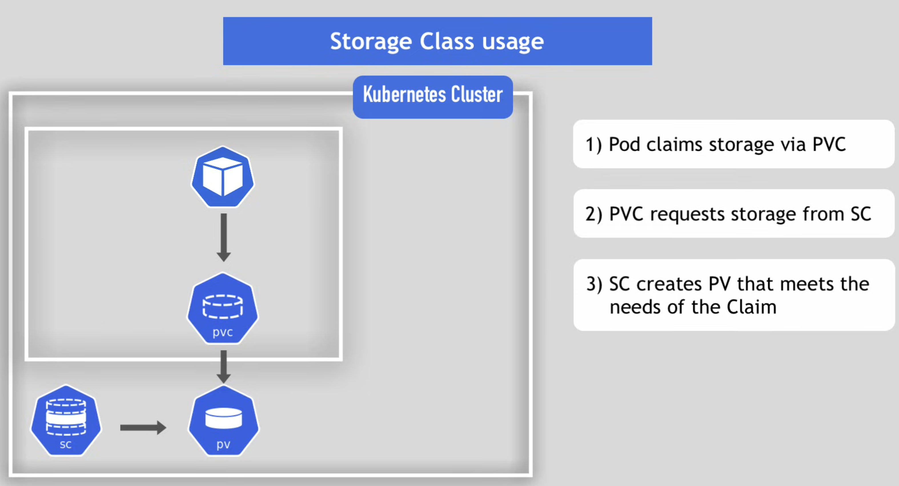
- `Deployment`. Абстракция над подами, позволяет управлять их количеством
    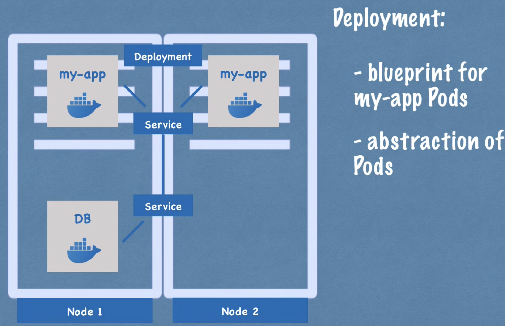
- `StatefulSet`. Компонент для управления компонентами с общими данными (базы данных). Но как правило базы находятся вне кластера k8s, управление этими компонентами внутри кластера довольно сложное
    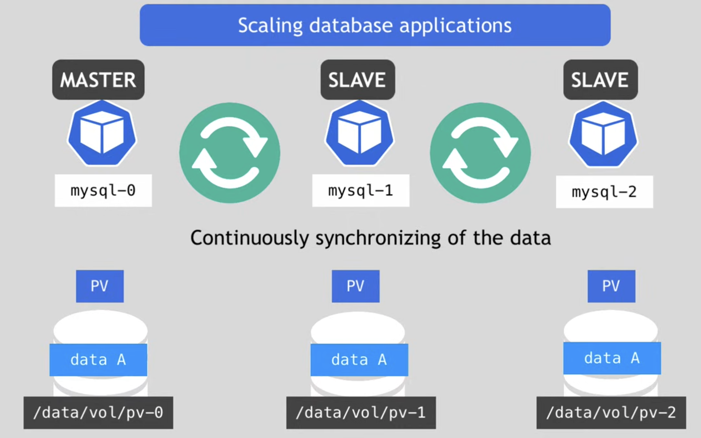
    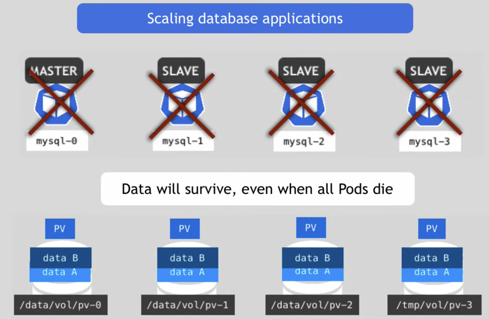

